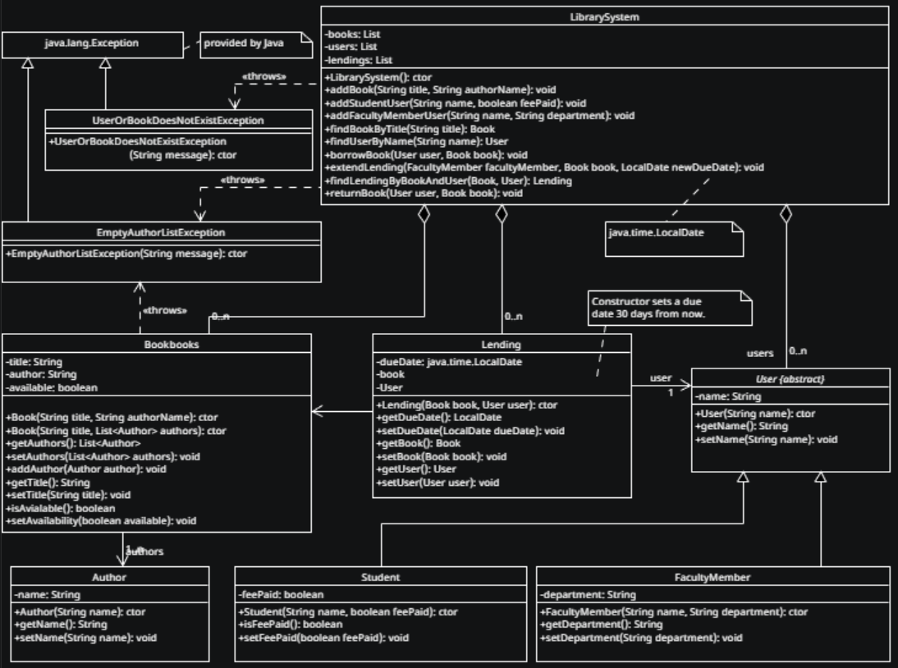

# HBV202GAssignment8
A Maven project skeleton. The provided Maven POM sets the Java version to 21.

This project skeleton is an extension of the library system from assignment 8. You can find the UML class diagram for the library system in the `UML` directory. 

[Documentation site from maven javadoc](target/reports/apidocs/index.html) 

[Documentation site from maven site](target/site/index.html) 

Maven commands:

- `mvn compile` compiles all implementation classes.
- `mvn exec:java` executes the `main` method of the implementation.
- `mvn test` runs test cases.